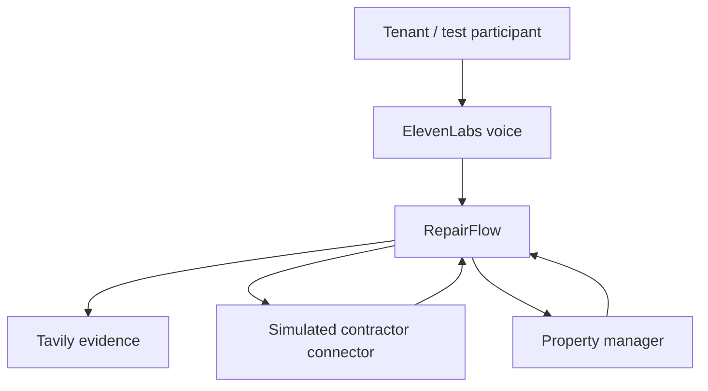
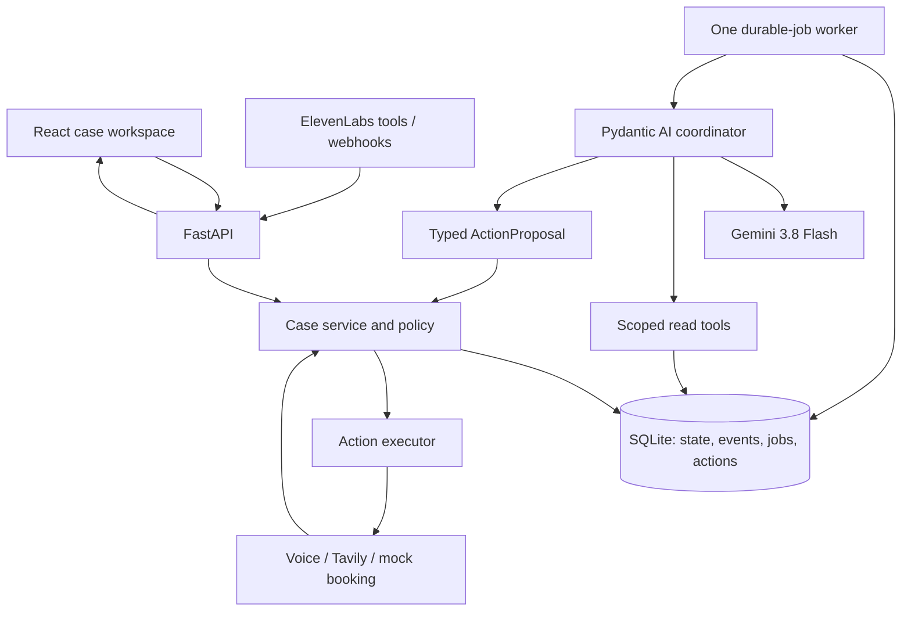

# 05 — System architecture

## Decision

A single Python application owns the case model, HTTP API, policy engine and database-backed worker. One Pydantic AI agent reasons over a current case snapshot. React renders persisted operational state. External integrations are adapters with explicit evidence and result contracts.

This is a hybrid: semantic interpretation by Gemini; lifecycle, authority, persistence and effects by application code.

## System context

The voice platform has its own conversational LLM; only the backend decides operational progression.

## Containers and components

## Runtime

1. Ingress authenticates and validates an observation.
2. One transaction records its source/dedupe identity, domain observation, immutable event and due job.
3. HTTP acknowledges; it does not await Gemini.
4. Worker leases the job, loads a case snapshot and checks deterministic safety gates.
5. Pydantic AI runs with read-only, case-scoped dependencies and bounded read tools.
6. Gemini returns a single typed ActionProposal. No reasoning transcript is used as authoritative state.
7. Executor rechecks case version, evidence IDs, policy and transition legality.
8. Local changes and action intents commit transactionally. External work happens after commit.
9. Confirmed/failed/unknown results create events and future jobs.
10. WAIT ends the run. A new event or due timer starts a new bounded run.

## Storage and concurrency

SQLite file on the same persistent host; WAL, foreign keys, short transactions, busy timeout and one worker. Do not place its file on a shared/network filesystem. WAL allows concurrent reads but a single writer. [SQLite WAL](https://sqlite.org/wal.html).

An in-memory wake signal may reduce latency, but the jobs table is authoritative. FastAPI BackgroundTasks alone is insufficient for restart recovery; its documented role is work after a response, not a persistent workflow ledger. [FastAPI background tasks](https://fastapi.tiangolo.com/tutorial/background-tasks/).

For MVP, process one job at a time. No transaction remains open during model calls. Webhooks can arrive meanwhile; a stale proposal fails its version check and is regenerated from current state.

## Deployment choice

Run locally: one FastAPI/Uvicorn process serving the Vite build and an application lifespan worker; SQLite and recordings under gitignored `data/`. Expose HTTPS through a development tunnel for ElevenLabs callbacks. Poll the case endpoint every second while active, slowing when idle.

Cloudflare Quick Tunnels explicitly lack SSE and production uptime guarantees; polling avoids that mismatch. [Quick Tunnel limitations](https://developers.cloudflare.com/cloudflare-one/networks/connectors/cloudflare-tunnel/do-more-with-tunnels/trycloudflare/).

This survives process restarts and multi-day waits **while the host and disk remain available**. It does not provide availability during laptop sleep, host-loss recovery or production durability. Move the same service to an always-on host and PostgreSQL before real residents depend on it.

## Alternatives considered

| Alternative | Why not MVP |
|---|---|
| Next.js plus Python API | Adds a second server without a needed SSR feature |
| PostgreSQL | Good production choice; provisioning unnecessary for one local worker |
| Supabase | Adds managed Postgres/Auth/Realtime capabilities; not needed for one synthetic operator |
| Redis/Celery | More infrastructure; DB jobs cover the bounded demo |
| Temporal/DBOS | Strong durable execution; workflow setup exceeds immediate need |
| Pydantic Graph | Describes execution graphs, but does not replace case records, authorization or side-effect reconciliation |
| Multiple agents | More context passing and failure surfaces; no separate authority domains here |
| Event sourcing | Full replay/rebuild complexity unnecessary; CRUD plus append-only audit is sufficient |

## Component contracts

| Component | Input | Output / authority |
|---|---|---|
| Ingress | Authenticated provider/operator observation | Event + job; no automatic case resolution |
| Case service | Typed command + trusted actor | Checked transaction |
| Coordinator | Snapshot + trigger + permitted action set | ActionProposal only |
| Policy | Proposal + current state + authorization | Allow, deny, require approval or escalate |
| Action executor | Authorized ledger row | Confirmed result, failure or reconciliation-required |
| Booking connector | BookingRequest | BookingOutcome; no assumed availability |
| Voice adapter | CallRequest/session context | Communication + transcript + recording + outcome |
| Research adapter | Trade/location query | Source-linked research snapshot |
| UI | CaseSnapshot + cursor | Readable operational truth; no direct status mutations |

## Future migration boundary

Keep SQLAlchemy domain services and provider adapters independent of the worker. A later queue/durable engine can invoke the same checked commands. PostgreSQL replaces the single-writer constraint with row locking/leases. No cloud worker may mutate a copied SQLite file.
