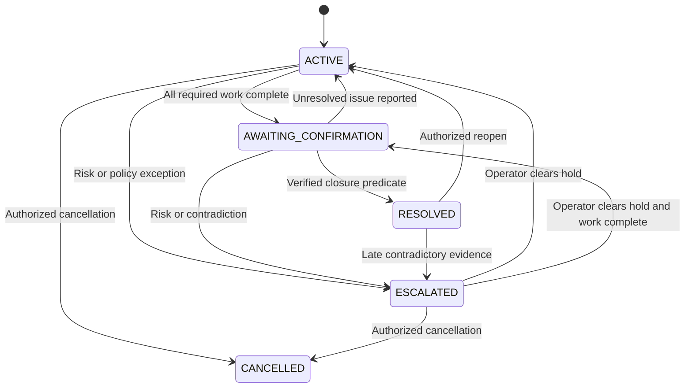
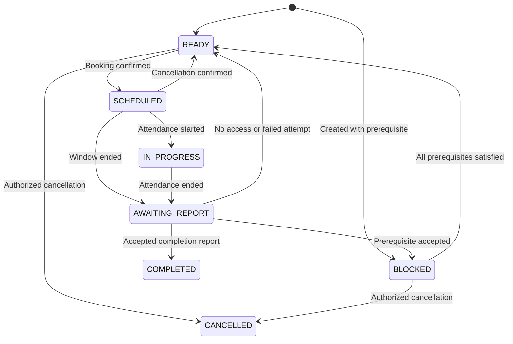
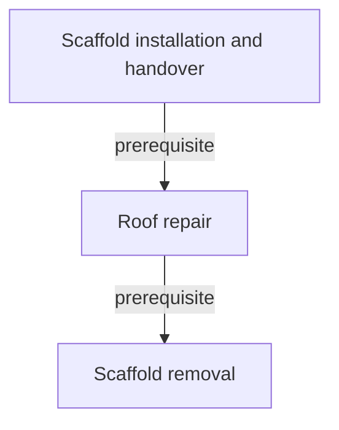

# 07 — State machines, dependencies and events

## Case versus work

`CaseStatus = ACTIVE | AWAITING_CONFIRMATION | RESOLVED | ESCALATED | CANCELLED`.

Creation yields ACTIVE. Waiting for information, a contractor or a prerequisite is represented by pending jobs/actions and work status, not a giant case-status enum. The UI derives a human-readable “waiting for” label.

Late contradictory evidence on a RESOLVED case moves it to ESCALATED, retaining the prior resolution event. Set resume_status to ACTIVE; an authorized operator can resume/reopen after review. An operator cannot clear a safety hold merely by retrying the agent.

## Work-order lifecycle

`WorkOrderStatus = READY | SCHEDULED | IN_PROGRESS | AWAITING_REPORT | BLOCKED | COMPLETED | CANCELLED`.

A valid final report may arrive without a start/end webhook. In that one transaction, normalize a CONFIRMED appointment to FINISHED and its work order to AWAITING_REPORT before applying the report. Do not reject legitimate missing-intermediate-event delivery.

## Transition guards

| Transition | Guard / effect |
|---|---|
| Case created → ACTIVE | Property/tenant resolved; immutable intake reference |
| READY → SCHEDULED | Valid overlap, approved contractor, allowed spend, no open blockers, confirmed connector result |
| Report → BLOCKED | Report matches appointment/work; cited prerequisite supported; edge cycle check |
| BLOCKED → READY | Every incoming dependency SATISFIED; no additional hold |
| Report → COMPLETED | Attributed accepted evidence; no unresolved blocker; attendance alone insufficient |
| Case → AWAITING_CONFIRMATION | All required orders COMPLETED; no unsafe or unknown commitments |
| Case → RESOLVED | Above plus explicit tenant issue confirmation and no unresolved concerns |
| Case → CANCELLED | Operator reason; no live commitment left unhandled; cancellation is not resolution |

Cancelled required work does not satisfy closure. Operator must explicitly change scope with a reason and human-reviewed residual risk.

## Appointment truth

PENDING means a request is in flight. CONFIRMED requires connector acknowledgment. FINISHED records an attendance attempt and its outcome, including BLOCKED or NO_ACCESS. CANCELLED requires actual connector/human confirmation. Wall-clock expiry only requests an outcome; it never proves completion.

A rebook creates a new appointment with incremented attempt number. Keep the original failed visit and report.

## Dependency model

Use one explicit relational table and a directed acyclic graph per case. Direction is **prerequisite → dependent**. All incoming edges must be satisfied (AND semantics). Parent/child grouping cannot express multiple prerequisites reliably.

When adding an edge P→D, reject if P=D, cases differ, or D already reaches P. Enforce uniqueness on the pair. Creation of new orders, report interpretation, edge and roofing block happens in one transaction.

Scaffold installation completion requires a report containing access handover evidence in the synthetic demo. In production that evidence must be checked by qualified people; RepairFlow does not certify scaffold safety.

On accepted prerequisite completion, satisfy relevant edges and recompute dependent readiness in the same transaction. Persist a DEPENDENCY_SATISFIED event and job. The model does not decide whether a satisfied graph edge unblocks a job; it decides the next useful operational step after the deterministic update.

If completion is later disputed, mark the edge INVALIDATED, stop new dependent work and escalate. Do not erase the old completion or automatically cancel an already-dispatched contractor without reconciliation.

## Canonical event taxonomy

| Event | Emitted by | Wake behavior |
|---|---|---|
| CASE_CREATED | Intake service | Triage |
| INFORMATION_RECEIVED | Voice/operator adapter | Reassess missing facts/risk |
| AVAILABILITY_RECEIVED | Confirmed voice/operator observation | Consider scheduling |
| RESEARCH_COMPLETED | Tavily adapter | Inspect candidates; no automatic vetting |
| WORK_ORDER_CREATED | Executor | Determine next action |
| APPOINTMENT_CONFIRMED | Booking adapter | Wait for attendance; schedule outcome timer |
| APPOINTMENT_CANCELLED | Confirmed connector/operator result | Replan availability |
| APPOINTMENT_WINDOW_ENDED | Due job | Request report; do not complete work |
| CONTRACTOR_REPORT_RECEIVED | Report service | Interpret outcome/prerequisite |
| DEPENDENCY_DISCOVERED | Atomic prerequisite command | Arrange prerequisite |
| WORK_ORDER_COMPLETED | Accepted report command | Recompute edges/closure readiness |
| DEPENDENCY_SATISFIED | Deterministic graph update | Resume affected work |
| TENANT_CONFIRMATION_RECEIVED | Voice/operator observation | Resolve or reopen work |
| FOLLOW_UP_DUE | Due job | Check latest state before contact |
| APPROVAL_DECIDED | Operator | Execute exact approved action or revise |
| CASE_ESCALATED | Policy/operator | Pause automatic external effects |
| CASE_RESUMED | Operator | Re-evaluate current snapshot |
| CASE_RESOLVED / CASE_CANCELLED | Domain service | No ordinary wake |
| CALL_ENDED / CALL_FAILED | Voice adapter | Ingest outcome; plan recovery if needed |
| RECORDING_AVAILABLE / RECORDING_FAILED | Recording worker | UI/audit only; no model wake |
| ACTION_FAILED / ACTION_UNKNOWN | Executor | Recovery or human review |

Routine trace events, polling and audio availability do not trigger reasoning. Multiple events from one transaction coalesce to one COORDINATE job for its final case version.

## Event processing

At-least-once delivery, idempotent domain application, no exactly-once external-action promise. Source-event keys suppress duplicates. Events retain occurrence and receipt times; sequence reflects commit order.

Out-of-order observations are retained. Apply against current state and matching appointment IDs. Old availability cannot overwrite a newer revision; an old visit cannot complete the latest rebooked appointment.

## Waiting and bounded progression

A WAIT proposal writes a waiting reason and optional due job, then exits. Repeated identical WAIT does not generate another wake. A root trigger may drive at most six consequential actions before pausing for operator review; this prevents an internal event feedback loop.

Live-mode follow-ups use policy intervals, initially one reminder after two business hours and human review after a second unanswered attempt. These are configurable **demo policy assumptions**, not statutory timescales. Simulation buttons advance observations without pretending elapsed time or unattended days actually occurred.
