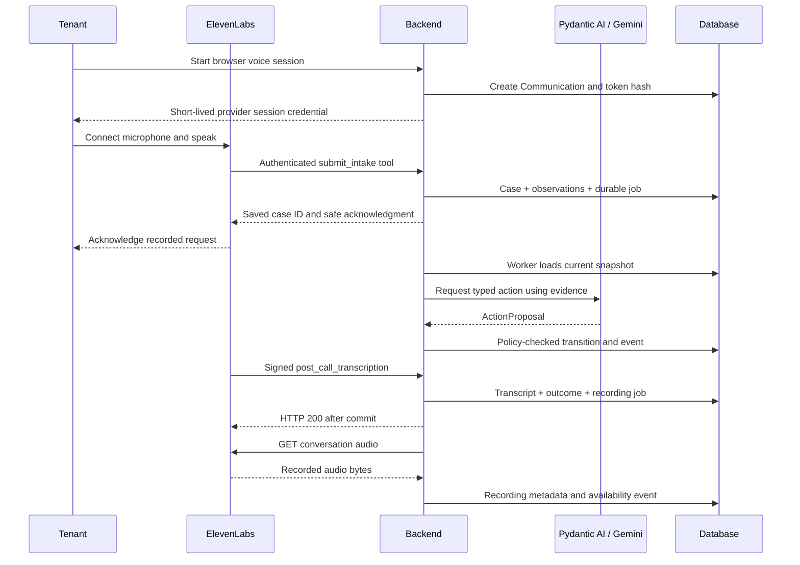
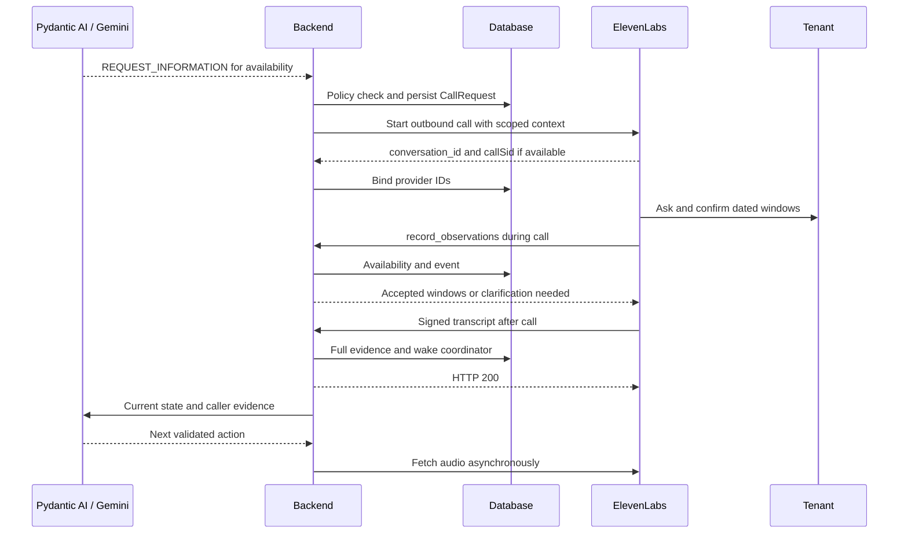

# 11 — ElevenLabs voice, recordings and transcript ingestion

## Decision and non-negotiable acceptance condition

ElevenLabs is the conversational interface. The backend is the operational authority. A live call must produce **saved audio, the full transcript, a case-linked outcome and a resulting case update**. A call animation or a provider dashboard alone does not satisfy the user's requirement.

Tavily does not record phone calls. Tavily search requests and evidence are logged separately and can be linked to the same repair case.

Use a real browser microphone conversation as the one-day baseline. It avoids telephone-number provisioning while exercising ElevenLabs voice, tools, transcription and audio retrieval. Inbound/outbound PSTN is a stretch integration. Clearly describe a browser conversation as such.

Use `@elevenlabs/react` and `useConversation`. For a concrete authenticated baseline, the backend obtains a signed WebSocket URL through `GET /v1/convai/conversation/get-signed-url?agent_id=...` with its API key. The browser calls `startSession` with signedUrl, `connectionType: "websocket"` and permitted dynamic variables, then sends the returned conversation ID to the bind route. WebRTC is also supported with a conversation token, but do not mix credential types. Audio travels directly between browser and ElevenLabs, not through the callback tunnel. [React SDK](https://elevenlabs.io/docs/eleven-agents/libraries/react).

ElevenLabs itself combines speech recognition, conversational model behavior and speech synthesis. It can run tools and workflows, but duplicating repair planning there would create two competing state owners. Let it ask, clarify, repeat back dates and communicate backend-confirmed facts. It cannot promise a contractor, clear a hazard or close a case. [Platform overview](https://elevenlabs.io/docs/agents-platform/overview).

## Agent configuration to implement

Use one maintenance conversation agent with purpose-specific dynamic context, not separate autonomous business agents. Configure:

- A concise AI/recording disclosure and explicit agreement for the demo participant.
- A synthetic property/tenant identity; ask for confirmation before associating a repair.
- Questions for description, location, onset, safety flags and explicit availability dates.
- Server tools `submit_intake`, `record_observations` and `get_conversation_context` exposed through the routes in 16.
- Backend-approved wording for emergency escalation; no repair or electrical instructions.
- Post-call transcription webhook, audio saving enabled, and retention long enough for retrieval and demonstration.
- Data-collection keys for `issue_description`, `location`, each named safety flag, `availability_json`, `tenant_confirms_resolved` and `missing_questions`. These are **our configured keys**, not promised built-in provider fields.

Server tools can be called during the conversation and can update application state immediately. Authenticate those tool requests with a dedicated secret header; do not confuse them with signed post-call webhooks. [Server tools](https://elevenlabs.io/docs/eleven-agents/customization/tools/webhook-tools).

The optional post-call analysis supplies extraction hints. Preserve and validate them separately from the full transcript; missing or uncertain values remain unknown. Prefer the caller-confirmed tool observations for exact dates. [Conversation analysis](https://elevenlabs.io/docs/eleven-agents/customization/agent-analysis).

## Correlation and identity

Before a browser/outbound session, create a Communication with a random high-entropy correlation token, store only its hash, and pass the token plus `communication_id`, `repair_case_id` when known, and `call_purpose` as dynamic variables. Never put API credentials into these variables. Bind the provider conversation ID to that record as soon as available.

Also provide the real current date and Europe/London timezone so the voice agent can ask the participant to confirm explicit dates. Backend validation, not the spoken phrase “next Tuesday,” determines whether an availability window is usable.

`system__conversation_id` and telephony metadata are provider context, not proof of tenant identity. The authoritative mapping is `provider_conversation_id → Communication → case_id`. For the first intake, `case_id` is null until identity is confirmed and `submit_intake` commits the case; the tool returns the new case reference to the voice agent. If a webhook arrives before binding, verify the one-time token and configured agent ID; otherwise quarantine it for operator review. Never trust an arbitrary caller-supplied case ID.

Custom variables personalize prompts and tool parameters. Provider-reserved `system__` variables include conversation and telephony identifiers. [Dynamic variables](https://elevenlabs.io/docs/eleven-agents/customization/personalization/dynamic-variables).

## Browser / inbound intake sequence

The asynchronous coordinator does not need to finish while the live tool waits. Return “Your report is saved; coordination is pending,” not invented operational results. In-call urgent observations take the immediate deterministic escalation path.

For PSTN inbound, import a purchased Twilio number and configure an inbound personalization webhook. It resolves the call to a scoped Communication and returns initiation context. Caller ID only locates a possible record; it is not authentication. Purchased numbers support inbound and outbound; verified caller IDs are outbound-only in the documented native integration. SIP trunking is another supported route, so Twilio is not universally mandatory. [Twilio integration](https://elevenlabs.io/docs/eleven-agents/phone-numbers/twilio-integration/native-integration), [Inbound personalization](https://elevenlabs.io/docs/eleven-agents/customization/personalization/twilio-personalization), [SIP](https://elevenlabs.io/docs/eleven-agents/phone-numbers/sip-trunking).

## Outbound availability sequence — stretch PSTN, same domain contract

For browser transport, REQUEST_INFORMATION creates a visible “Join availability call” task; it does not pretend to ring a phone. The same structured observation and recording paths then apply.

The real Twilio adapter would call `POST https://api.elevenlabs.io/v1/convai/twilio/outbound-call` using server-side `xi-api-key`; body includes `agent_id`, `agent_phone_number_id`, `to_number` and `conversation_initiation_client_data`. Persist returned `conversation_id` and `callSid` when present. A successful initiation is not an answered call or confirmed appointment. [Outbound API](https://elevenlabs.io/docs/api-reference/integrations/twilio/outbound-call).

Tenant follow-up reuses this flow with purpose FOLLOW_UP and issue-specific questions. Contractor calling is technically possible through the same telephony transport, but actual supplier outreach and a contractor-targeted request schema are POST-HACKATHON. The MVP requests missing contractor information through an operator task; it does not put a contractor number into the tenant-call model.

## Post-call adapter

Accept the provider envelope with `type`, `event_timestamp`, and `data`; adapt known fields without rejecting harmless new fields. Relevant event types are `post_call_transcription`, `post_call_audio` and `call_initiation_failure`. Verify `ElevenLabs-Signature` against the raw body and configured signing secret using the current SDK verifier, including timestamp validation. Persist a receipt before returning HTTP 200. [Post-call webhooks](https://elevenlabs.io/docs/eleven-agents/workflows/post-call-webhooks).

For transcription:

1. Resolve `data.conversation_id`; verify configured `data.agent_id` and mapping/token.
2. Save original payload in protected evidence storage, and normalize `data.transcript` into ordered TranscriptTurn records. Preserve USER versus AGENT roles and timing. Do not copy a summary into the transcript field.
3. Adapt `data.analysis` and any tool observations into CallOutcome. Retain raw extraction alongside normalized values. Parse configured availability JSON into timezone-aware windows; reject ambiguous dates and ask again.
4. Reconcile duplicate in-call observations by evidence identity/value; only changed facts emit new domain events. Contradictions remain visible and trigger review.
5. Mark call ended/failed, enqueue FETCH_RECORDING and, if new operational information exists, COORDINATE. Audio availability itself does not re-run the agent.

The backend passes the relevant transcript turns and evidence IDs to Gemini in the next case snapshot. Thus the application actually sees and reasons over what the participant said, even when the voice agent omitted a structured field.

## Audio saving and retrieval — required

Provider recording is configurable, not something to assume. Enable audio saving and choose nonzero transcript/audio retention; maximum-privacy settings can prevent the required evidence from existing. Use consenting synthetic demo conversations and a documented short retention policy. [Privacy settings](https://elevenlabs.io/docs/eleven-agents/customization/privacy).

FETCH_RECORDING calls `GET /v1/convai/conversations/{conversation_id}` to inspect status/audio flags, then `GET /v1/convai/conversations/{conversation_id}/audio` with a backend API key. Save the returned bytes under a server-generated filename outside the frontend directory. Record MIME type, byte count, SHA-256 and acquisition time. Verify nonempty content before AVAILABLE. Serve through the authenticated application recording endpoint, never a public filesystem URL. [Conversation details](https://elevenlabs.io/docs/api-reference/conversations/get), [Conversation audio](https://elevenlabs.io/docs/api-reference/conversations/get-audio).

Our retry policy: attempts after 5, 15, 30 and 60 seconds; then show FAILED/UNAVAILABLE with a manual retry. These delays are application choices, not provider delivery guarantees. Do not silently degrade to transcript-only. The optional audio webhook can supply bytes too, but implementing both retrieval mechanisms is unnecessary for MVP.

If the transcription webhook is missing, the scheduled FETCH_RECORDING job first retrieves conversation details after the browser session ends or a call times out, reconciles any missing transcript/outcome, and then retrieves audio. Use the same receipt/deduplication path. Browser disconnect is not proof provider processing finished. If no intake tool ever confirmed identity/created a case, preserve the unbound communication and require operator binding; do not discard the call or attach it to a guessed property.

## Live integration acceptance test

Use a participant-selected harmless phrase and an availability window not hard-coded in seed data. Complete a real call, then verify:

- the UI shows the actual user phrase under the correct speaker;
- audio plays back and includes that phrase;
- provider conversation ID is visible in the evidence panel;
- structured availability matches the spoken dates or is explicitly flagged for clarification;
- the next decision cites that communication/turn and respects the availability;
- all of this survives backend restart;
- replaying the webhook creates neither a second case nor duplicate availability/booking;
- a Tavily search shows its query, request ID when supplied, returned URLs and timestamp separately.

This test is a required implementation gate. **No live integration has been configured or exercised during this documentation phase.**
