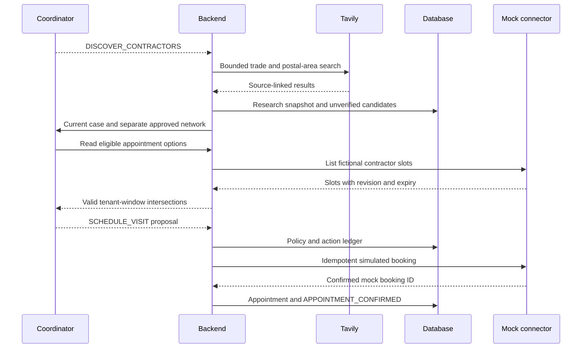

# 12 — Tavily and contractor discovery

## Responsibility

Tavily supplies web evidence for candidate discovery. It cannot establish a contractor's current availability, willingness to accept a job, insurance, competence or price. Our app logs every query and returned source so the research behind a recommendation is inspectable.

Search is SHOULD HAVE after the durable dependency loop and recorded voice work. If unavailable, use explicitly labelled research fixtures; never label fixtures LIVE. Removing Tavily leaves a useful preferred-contractor workflow, but removes live open-web discovery.

## Current API assessment

| Capability | Fit | MVP decision |
|---|---|---|
| Search | Bounded local trade/provider discovery | One basic search, maximum five results |
| Extract | Read a selected contractor's service/contact page | Optional; maximum two pages |
| Crawl | Follow a website across pages | Cut: excessive latency, scope and irrelevant data |
| Map | Discover site URL structure | Cut: unnecessary for a small query |
| Pydantic AI integration | Official documented helper available | Custom wrapper preferred for domain output and budgets |

Search uses `POST https://api.tavily.com/search` with bearer authentication. Specify query, basic depth, small result cap and no synthesized answer. Save result title, URL, content excerpt and retrieval score, plus request ID if returned. Search score measures relevance, not contractor quality. [Search API](https://docs.tavily.com/documentation/api-reference/endpoint/search).

Extract retrieves selected-page content; Crawl and Map support broader site exploration. [Extract](https://docs.tavily.com/documentation/api-reference/endpoint/extract), [Crawl](https://docs.tavily.com/documentation/api-reference/endpoint/crawl), [Map](https://docs.tavily.com/documentation/api-reference/endpoint/map). The documented Pydantic AI helper is `pydantic_ai.common_tools.tavily.tavily_search_tool`; our adapter deliberately narrows its scope. [Integration](https://docs.tavily.com/documentation/integrations/pydantic-ai).

## Runtime contract

Coordinator proposes DISCOVER_CONTRACTORS with trade and property postcode. Backend composes a query such as “roof repair contractor [postal area] service area contact”; do not send tenant name, phone number or full repair transcript to search.

Persist ResearchSnapshot before returning ContractorSearchResult. Extract candidate claims with EvidenceRefs. For unsupported values use null, not guesses. A claim of emergency service is a website claim with a timestamp, not a live dispatch promise. Normalize duplicate domains but do not automatically merge unrelated companies that share a trading name.

Candidates remain UNVERIFIED. The MVP may display them beside a separate seeded approved contractor network; it must not manufacture a mock booking under a real searched company's identity. Approved demo firms have fictional names and SIMULATED provenance.

## Discovery and booking sequence

## Alternatives and production recommendation

| Source | Advantage | Limitation |
|---|---|---|
| Existing agency contractor network | Actual commercial relationship, approval and known dispatch process | Requires agency onboarding/data quality; strongest production default |
| Google Places | Structured business search, location and supported place attributes | Quotas/field masks/attribution; no general job-availability or booking guarantee |
| Checkatrade | UK trade discovery and consumer-facing screening claims | Universal third-party booking API/access not established in this research |
| TrustATrader / Rated People | Relevant UK marketplace/directory leads | API/commercial access and permitted reuse UNKNOWN; do not scrape behind controls |
| Tavily open-web search | Fast, explainable discovery for a hackathon | Unstructured/stale/self-reported claims and prompt-injection exposure |

Google's official Text Search API is a credible structured alternative, but not an availability system. [Places Text Search](https://developers.google.com/maps/documentation/places/web-service/text-search). Checkatrade's public service demonstrates directory relevance; it does not establish an integration right. [Checkatrade](https://www.checkatrade.com/).

Production procurement should start with an approved network and add discovery as a supervised supplier-onboarding function. Keep source attribution and review data-use terms before storing directory reviews/ratings. Do not infer insurance or competence from a search snippet.

## Validation and failure handling

Eight-second request budget, one read-only retry on transient errors, bounded excerpts and no arbitrary follow-up browsing. These are application budgets. API keys stay server-side. Retrieved text is untrusted evidence, never instructions. Strip active markup, constrain URL schemes, and let Tavily perform retrieval rather than building a general backend URL fetcher. Never execute links or instructions embedded in results.

On no results, preserve the attempt and return an empty candidate list with warning. Continue with an approved seeded contractor only if available and suitable; otherwise escalate. A provider failure must not erase earlier research or cause a fabricated search result.
