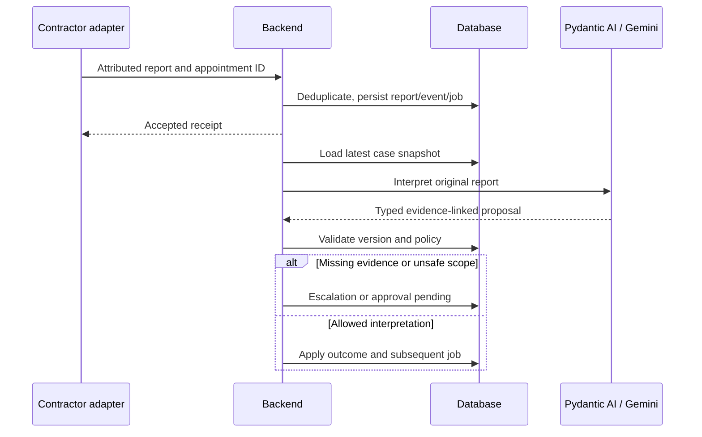
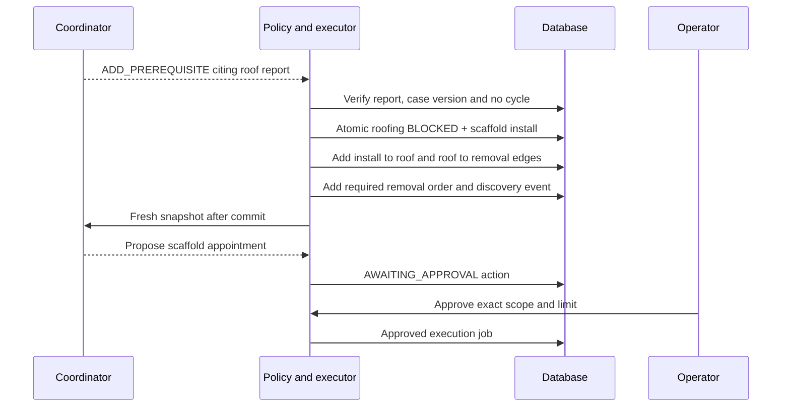
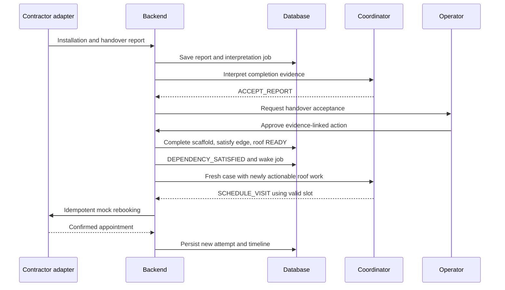

# 16 — HTTP API, webhooks and event sequences

> **Partially superseded (2026-09-20).** This document describes the 26-route MVP surface. The application now serves 58 routes; the additions are listed in `docs/UI2_IMPLEMENTATION_HANDOFF.md` §1 and recorded in `docs/26` entry 23. Everything below is still accurate for the routes it covers — it is incomplete, not wrong.

These are **RepairFlow application routes**, not vendor endpoints. JSON models are defined in 06/10. Prefix ordinary API routes with `/api/v1`. Generate OpenAPI and a TypeScript client once implemented.

## Shared conventions

Every mutation accepts `Idempotency-Key`. Operator mutations additionally include `expected_case_version` in the body. A duplicate key with identical payload returns the original result; conflicting reuse is HTTP 409. Version conflicts return 409 STALE_VERSION with current version. Invalid input is 422; forbidden scope 403; missing record 404; provider work accepted for asynchronous execution 202.

Errors have `{error: {code, message, retryable, correlation_id}}`. Do not leak provider secrets or full transcripts in errors. Lists return `{items, next_cursor}`; case detail returns `{snapshot, latest_event_seq}`. External webhook acknowledgments follow the provider requirement: ElevenLabs receives **200 after durable acceptance**, not the ordinary 202 command response.

## Operator and UI endpoints

| Method/path | Input | Result / behavior |
|---|---|---|
| GET `/healthz` | None | Liveness only, no secrets |
| GET `/api/v1/readiness` | Operator auth | DB/worker/integration configuration state; no costly provider calls |
| GET `/api/v1/cases` | cursor, limit | Compact case list |
| GET `/api/v1/cases/{id}` | optional known version | CaseSnapshot; ETag or unchanged response for polling |
| GET `/api/v1/cases/{id}/events` | after_seq, limit | Ordered event page |
| GET `/api/v1/cases/{id}/runs` | cursor, limit | OrchestrationRun and redacted ToolTrace records |
| POST `/api/v1/intakes` | IntakeSubmission | Case/communication binding; 201 new or 200 duplicate |
| POST `/api/v1/cases/{id}/observations` | ObservationSubmission | Accepted sourced facts; 202 |
| POST `/api/v1/cases/{id}/reports` | ReportSubmission | Persist report and enqueue interpretation; 202 |
| POST `/api/v1/actions/{id}/approval` | ApprovalDecision | Approval/rejection of exact action; 202 |
| POST `/api/v1/appointments/{id}/cancel` | CancellationRequest + version | Cancellation intent; 202; not immediate proof |
| POST `/api/v1/cases/{id}/resume` | version, reason, resolved_hold_evidence | Operator-reviewed hold release; 202 |
| POST `/api/v1/cases/{id}/reopen` | version, reason, evidence_refs | Authorized RESOLVED or reviewed late-evidence ESCALATED → ACTIVE; 202 |
| POST `/api/v1/cases/{id}/cancel` | version, reason | Guarded case cancellation; 202 |
| POST `/api/v1/voice/sessions` | VoiceSessionRequest | Communication ID, expiring session credential, dynamic context |
| POST `/api/v1/voice/sessions/{id}/bind` | provider_conversation_id | Validate provider ownership/context then bind; not arbitrary case reassignment |
| POST `/api/v1/voice/sessions/{id}/ended` | provider_conversation_id | Schedule reconciliation; browser notification is advisory |
| GET `/api/v1/communications/{id}` | None | Full transcript, outcome, recording status and provider ID |
| GET `/api/v1/communications/{id}/recording` | optional Range | Protected audio bytes, correct media type; 409 if pending |
| POST `/api/v1/communications/{id}/retry-recording` | None | Idempotent FETCH_RECORDING job |
| GET `/api/v1/research/{id}` | None | Logged query, timestamp, sources, candidates, provenance |
| POST `/api/v1/demo/reset` | confirm_reset=true | Synthetic demo only; clear selected demo dataset, not real evidence silently |
| POST `/api/v1/demo/cases/{id}/observations` | SimulationObservation | Inject attributed simulated external observation |

VoiceSessionRequest fields: `purpose, tenant_id, case_id: UUID|None, disclosure_accepted: bool`. INTAKE permits null case. Other purposes require an existing scoped case and pending communication request. The backend supplies agent ID, correlation token and context; the UI cannot override operational instructions.

SimulationObservation is a discriminated union of `CONTRACTOR_REPORT {appointment_id, text, observed_at}`, `TENANT_FEEDBACK {confirms_resolved, text}`, and `ATTENDANCE_WINDOW_ENDED {appointment_id}`. It uses the same domain services as real observations and always sets SIMULATED. No `set_status` simulation endpoint.

## ElevenLabs endpoints

| Route | Authentication | Body/response |
|---|---|---|
| POST `/webhooks/elevenlabs/post-call` | Raw-body ElevenLabs-Signature verification | Provider envelope → receipt ID; HTTP 200 after commit |
| POST `/integrations/elevenlabs/tools/intake` | Dedicated bearer secret + scoped correlation token | IntakeSubmission without trusted actor fields → saved case reference/safe acknowledgment |
| POST `/integrations/elevenlabs/tools/observations` | Same, bound conversation | ObservationSubmission → accepted fields and clarification requests |
| POST `/integrations/elevenlabs/tools/context` | Same | communication_id/token → minimum permitted conversation context |
| POST `/integrations/elevenlabs/inbound-context` | Configured inbound webhook authentication | Provider inbound metadata → initiation context; PSTN stretch |

Tool bodies also carry `provider_conversation_id` when available and the scoped token. The adapter supplies tenant/property permissions from the bound session; it does not accept arbitrary privilege from the tool's language-model arguments.

Provider server tools may not supply an application Idempotency-Key header. For those routes, derive the key from the bound conversation, tool invocation ID when available and normalized observation hash. If invocation IDs are absent, identical repeated intake/observations merge within that conversation; a genuinely revised value creates new evidence. Public voice input uses FactInput/AvailabilityInput rather than persisted records. The server supplies all evidence IDs, provenance and case linkage.

Webhook receipt uniqueness: `(provider, event_type, conversation_id, event_timestamp, body_sha256)`. Domain uniqueness separately prevents two differently formatted deliveries from applying the same semantic observation. Store accepted envelope/body hash and processing status. Unsupported event types are durably recorded as ignored; invalid signature receives 401; valid but unmapped calls are quarantined, acknowledged and exposed for review.

Limit transcription/tool request sizes, rate-limit public routes, compare secrets safely and reject stale signature timestamps using the provider verifier. Audio is fetched by a worker, keeping large media out of this webhook route. Webhook processing never waits for Gemini.

## Minimal demo authentication

Protect the UI and operator API with one HTTP Basic operator credential from environment configuration; HTTPS tunnel required for remote use. No password in source, frontend bundles or query strings. Serve frontend and API from one origin; validate Origin on browser mutations and never mutate via GET. Separate provider routes use their own verification and bypass operator Basic only for those exact paths.

This is a synthetic single-operator demo boundary, not production multi-tenant authentication. Real residents require proper identity, roles, tenant isolation and audit controls before launch. Recording downloads use the same operator protection; they are never public static assets.

## Contractor report sequence

## Dependency-discovered sequence

The graph is created by an interpreted report, not a pre-existing scaffold branch hard-coded into the initial case. The scaffold-removal safety obligation is a deterministic domain rule once scaffold work is introduced.

## Prerequisite completion and resumption

Automatic continuation follows the approval and observed completion; it does not mean the model certifies scaffold safety. Roof completion subsequently releases removal through the same edge mechanism.

## Versioning and acknowledgments

Keep `payload_version=1` on application events; do not overwrite historical payloads when models change. Operator edits and webhook observations increment the case version when they change operational state. Recording metadata/timeline-only events advance event sequence but need not invalidate an unrelated operational proposal. Poll responses include both version and latest_event_seq so evidence updates remain visible.

Demo observation time can be advanced by an injected domain clock for future appointments. Signature validation, real call/media timestamps, leases and credentials always use actual UTC time. Never advance the security clock to make a simulation work.
