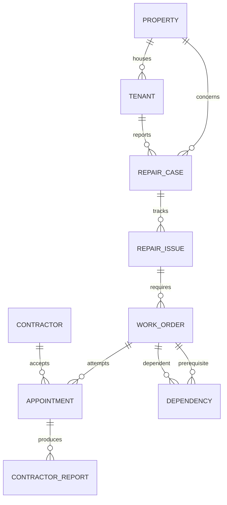
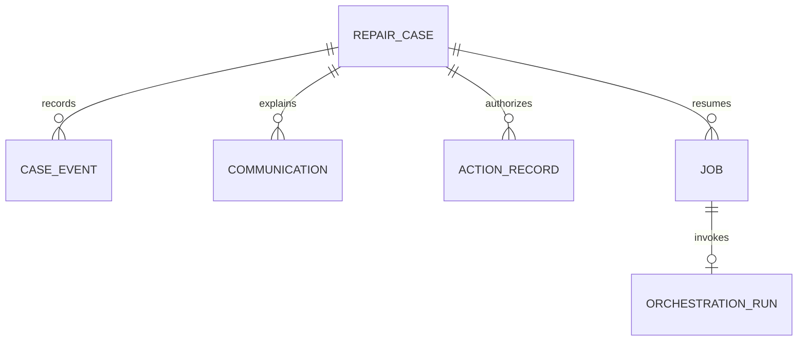

# 17 — Persistence, jobs and transactions

> **Partially superseded (2026-09-20).** Four tables (`archive_batches`, `notes`, `documents`, `cost_entries`) and several columns were added after this was written; see `docs/UI2_IMPLEMENTATION_HANDOFF.md` §1 and `docs/26` entry 24. Everything below is still accurate for the tables it covers — it is incomplete, not wrong.

## Recommendation

Use SQLite on a persistent local disk, SQLAlchemy 2.0 and Alembic. One Uvicorn process and one worker. Enable foreign keys, WAL and a busy timeout; use short transactions and a deliberate synchronous setting (FULL for the demo's recovery tests). WAL still has one writer and is not suitable for a shared network database file. [SQLite WAL](https://sqlite.org/wal.html).

PostgreSQL is the production migration target. Supabase offers managed PostgreSQL plus additional services, but those services are not prerequisites for this single-operator prototype. [Supabase database](https://supabase.com/docs/guides/database/overview). Do not introduce two live databases or pretend SQLite tests prove distributed concurrency.

## Tables and relationships

Operational history and resumption records:

Diagram omits auxiliary tables for readability. Include `availability_windows`, `research_snapshots`, `contractor_candidates`, `orchestration_runs`, `webhook_receipts`, and mock connector `mock_slots` / `mock_reservations`. Communications can be temporarily unbound before intake, so their case FK is nullable.

## Storage mapping

Use UUID text primary keys and UTC timestamps. Enums have CHECK constraints. Foreign keys enforce existence; service validators additionally enforce same-case ownership. Keep queryable state and IDs in columns. JSON columns are acceptable for risk details, typed action payloads, transcript turns, source evidence, provider envelopes and results; validate through Pydantic on write/read boundaries.

Audio bytes live in `data/recordings/{communication_uuid}.{validated_extension}`, not in SQLite. Store metadata and digest in Communication. Write a temporary file, atomically rename after a successful download, then mark AVAILABLE in a transaction. After a crash, safely remove orphan temporary files or retry; never mark a nonexistent file AVAILABLE. Backups need database plus recordings.

## Required constraints and indexes

| Table | Constraint / index |
|---|---|
| repair_cases | version positive; index status/updated_at |
| repair_issues | case FK; MVP one original issue per case enforced |
| dependencies | unique prerequisite/dependent pair; unequal IDs; index dependent/status; cycle check in service |
| appointments | unique work_order/attempt_number; unique connector/provider_booking_id when nonnull; index work_order/status |
| availability_windows | start < end; index case/person/revision; never overwrite old revision |
| case_events | unique case/seq; unique case/source_event_key; index case/received_at |
| action_records | unique idempotency_key; payload hash; index case/state |
| jobs | unique dedupe_key; index status/run_at; index lease_until |
| communications | unique provider_conversation_id when nonnull; index case; token hash unique |
| webhook_receipts | unique provider receipt identity; payload hash; processing status |
| mock_reservations | unique action/idempotency key; prevent two active reservations for same slot |

Do not invent cross-table CHECK constraints that SQLite cannot enforce. Same-case dependency ownership, temporal overlap, active-appointment uniqueness and DAG cycles belong in checked service transactions. The single writer makes the MVP race model manageable; database constraints still prevent basic duplicates.

## Transaction patterns

**Observation ingress:** validate actor/identities → insert source receipt if new → store observation → increment case version if operationally changed → append event with next per-case sequence → insert COORDINATE job for final version → commit → acknowledge.

**Local action:** reload latest state → compare proposal version → validate policy → acquire action identity → update domain rows and append events → enqueue follow-on job → commit. Duplicate returns original result.

**External action:** commit PENDING intent and execution job first → claim action RUNNING → invoke provider without database lock → commit confirmed outcome/FAILED/UNKNOWN and event. A network timeout after sending may mean success happened; use UNKNOWN and reconciliation.

The original model version guards admission, not the arrival of a previously sent provider result. Approval/execution follows the revalidation procedure in 10 so its own approval event does not invalidate its immutable action. A changed case may require a compensating/review action, but a real provider acknowledgment must still be recorded.

**Dependency completion:** accept report → mark prerequisite COMPLETED → set outgoing edges SATISFIED with evidence → set each dependent READY only when all incoming edges satisfied → append completion/dependency events → one follow-on job → commit. All or nothing.

## Worker algorithm

At startup and every 0.5–1 second, inspect due jobs. Claim one with an atomic conditional update under a short write transaction; set LEASED, lease_until and increment attempts. No open transaction spans network calls. Persist result before marking DONE. A process crash leaves an expired lease for recovery.

Use a 60-second lease, exceeding the 25-second model budget; renew for longer media retrieval if needed. These are application constants. Recover expired COORDINATE/read-only jobs safely. For EXECUTE_ACTION, inspect the action ledger first: RUNNING external effects require reconciliation, not automatic repeat. Mock connector booking is idempotent and stored locally.

Jobs have a dedupe key such as `coordinate:{case_id}:{version}`. On claim, load the latest snapshot even if the trigger was older. Permit one active coordinate run per case; a new observation during inference creates a newer job. If the old output is stale, mark that run SUPERSEDED and ensure the latest-version job exists.

Follow-up jobs recheck case/action state before doing anything. A resolved case's old timer becomes a no-op. WAIT without a due time leaves no busy loop. Do not keep a Python coroutine asleep for days.

## Case version versus timeline sequence

`case.version` is an optimistic-concurrency token for operational facts. `CaseEvent.seq` is an ordered audit/UI cursor; recording readiness can advance it without invalidating a booking decision. Increment sequence atomically, never by an unprotected read/max/write.

SQLAlchemy's version support can detect conflicting ORM updates, but bulk updates need explicit handling. Use a checked update such as “WHERE id and version match” and verify one row changed; do not assume a mapper setting guards every code path. [SQLAlchemy versioning](https://docs.sqlalchemy.org/en/20/orm/versioning.html).

## Audit without full event sourcing

Current rows answer operational queries. Append-only CaseEvents explain changes, actors, evidence and causation. The application does not rebuild all state by replaying every past event; migrations operate on normal relational state.

Do not expose event update/delete endpoints. Corrections append a superseding observation. This is application-level immutability, not cryptographic tamper-proof storage. Data-retention/erasure processes may remove protected personal payloads under an audited policy while retaining nonpersonal event structure; “immutable” cannot mean “retain sensitive recordings forever.”

## Backup and migration boundary

Use SQLite's supported backup mechanism rather than copying only the live main file while WAL writes continue. Keep a pre-demo synthetic seed reset and a separate saved live-call evidence record. Do not let reset silently delete the evidence used to claim a live integration passed.

Before real operations: always-on hosting, PostgreSQL, migrations/backups, object storage for recordings, tenant isolation, provider reconciliation and a proper incident process. A production durable engine can invoke the same domain commands; it does not replace their predicates.
